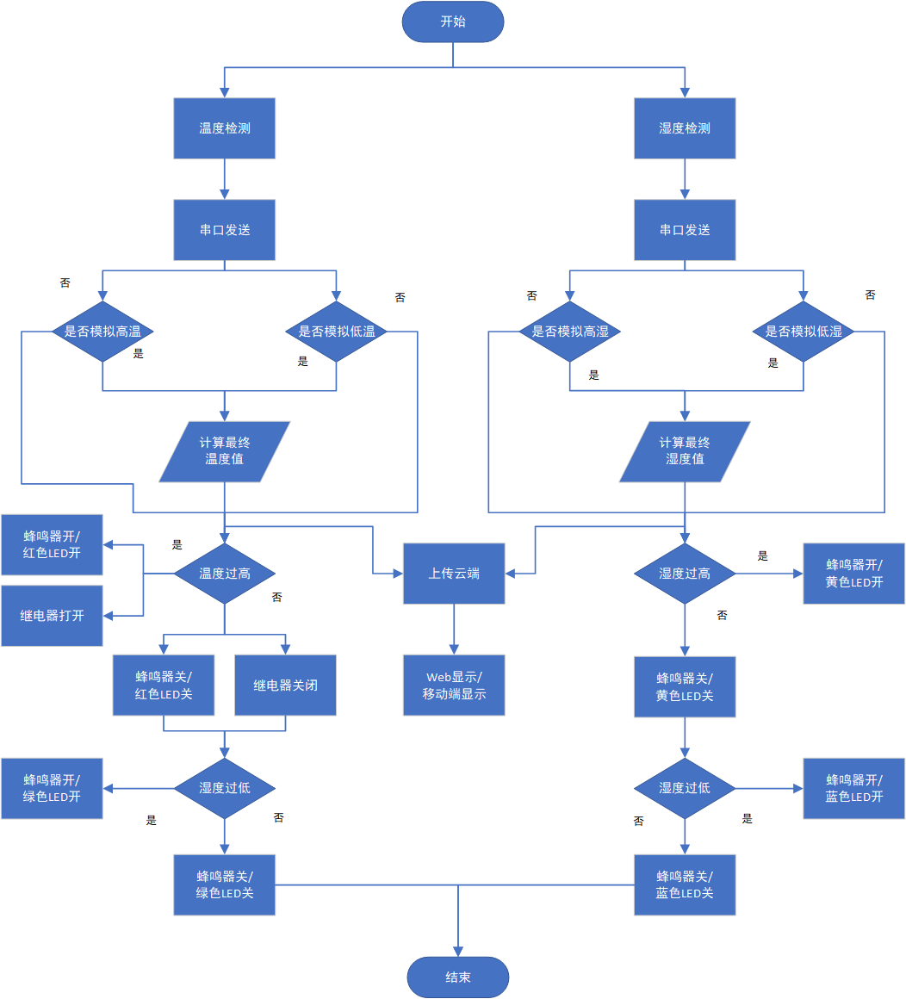
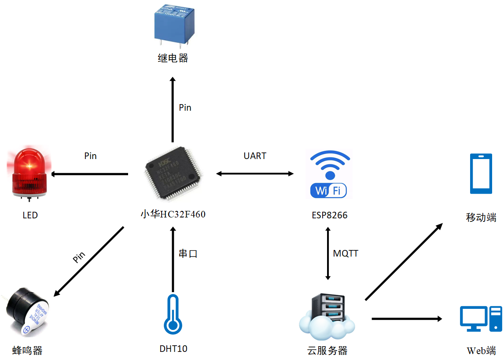
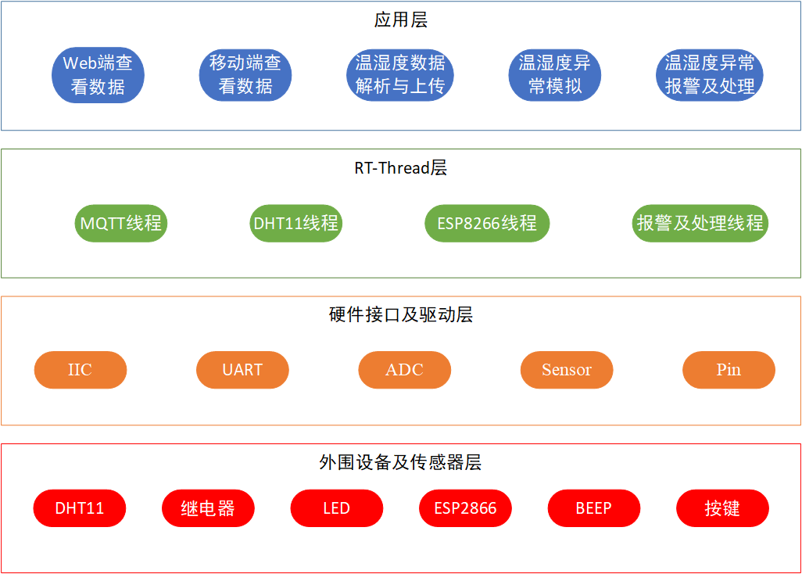
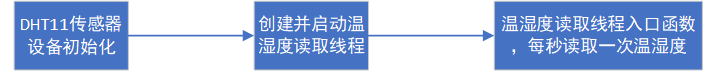
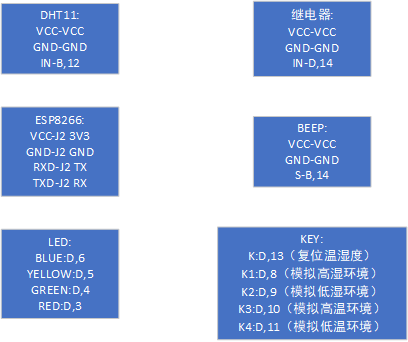
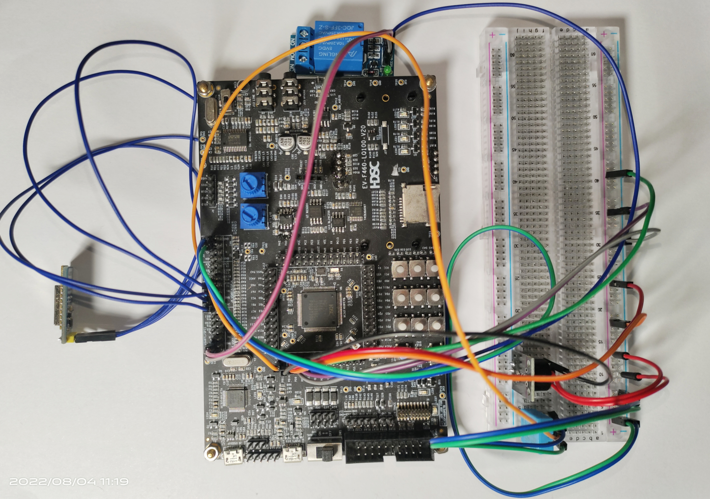

# rtt_2022summer

1.背景：  
现代农业的发展离不开科技的进步，受控农业的研究和应用技术越来越受到重视，特别是温室工程己成为工厂化高效农业的一个重要组成部分。本课题意在建立一套简易的蔬菜大棚温湿度自控系统。

2.实现功能：  
主要实现了蔬菜大棚的温湿度监控（包括Web网页端和移动端）；温湿度异常报警及处理；温湿度异常模拟的功能。

3.RT-Thread使用情况概述：  
3.1 内核函数  
(1) 消息队列：DHT11将获取的温湿度值通过消息队列发送给MQTT线程。  
(2) 互斥量：通过互斥量对临界区进行保护。  
(3) 信号量：MQTT线程通过信号量实现上阿里云的订阅与发布。  
3.2 软件包使用情况  
(1) dht11-latest软件包  
(2) AT_DEVICE-latest软件包  
(3) cJSON-latest软件包  
(4) beep-v1.1.0软件包  
(5) Ali-iotkit-latest软件包  
(6) WebClient-latest软件包  
3.3 设备驱动框架使用情况  
(1) pin设备驱动框架  
(2) IIC设备驱动框架  
(3) UART设备驱动框架  
(4) Sensor设备驱动框架  
(5) ADC设备驱动框架  

4.整体系统框架：  

5.硬件框架:  

6.软件框架:  

7.软件模块说明：  

8.硬件接线：  

8.作品完整图片：  

